# 🚀 AI Micro-Project Generator

<div align="center">

[](https://python.org)
[](LICENSE)
[]()
[](https://deepwiki.com/AaLexUser/AI-micro-project-generator)

*Transform learning challenges into focused, hands-on micro-projects with AI*

[🎯 Features](#-features) • [🚀 Quick Start](#-quick-start) • [📖 Documentation](#-documentation) • [🐳 Docker](#-docker-deployment) • [🛠️ Development](#%EF%B8%8F-development)

</div>

---

## 🎯 What It Does

The AI Micro-Project Generator is an intelligent educational tool that transforms error descriptions, learning challenges, or coding issues into **structured, bite-sized learning projects**. Perfect for educators, students, and developers who want to learn from their mistakes through practical, hands-on experience.

### ✨ Key Features

- **🎓 Smart Project Generation**: Converts issue descriptions into structured learning tasks
- **🔍 AI-Powered Analysis**: Uses advanced LLMs to understand and categorize problems
- **⚡ Safe Code Execution**: Sandboxed Python environment with preinstalled libraries
- **📝 Detailed Feedback**: Get personalized feedback on your solutions
- **🎨 Beautiful Web Interface**: Modern React-based frontend with Tailwind CSS
- **🔧 Flexible Configuration**: Extensive customization through YAML configs
- **🐳 Production Ready**: Complete Docker setup for easy deployment

### 🎯 Generated Projects Include

- **📋 Task Description**: Clear, focused learning objectives
- **✅ Success Criteria**: Measurable outcomes for completion
- **👨‍💻 Expert Solution**: Reference implementation and guidance
- **🔄 Interactive Feedback**: AI-powered code review and suggestions

---

## 🚀 Quick Start

### Prerequisites

Before you begin, ensure you have:

- **Python 3.12+** installed
- **[uv](https://github.com/astral-sh/uv)** package manager
- **Docker** (for sandbox execution and deployment)
- **Node.js 18+** (for frontend development)

### ⚡ Installation

1. **Clone the repository**
   ```bash
   git clone https://github.com/AaLexUser/AI-micro-project-generator.git
   cd AI-micro-project-generator
   ```

2. **Install dependencies**
   ```bash
   uv sync
   ```

3. **Set up configuration**
   ```bash
   cd aipg/configs
   cp default.yaml.example default.yaml
   ```

4. **Configure your environment**
   ```bash
   # Edit default.yaml with your API keys
   nano default.yaml
   ```

   Required environment variables:
   ```yaml
   llm:
     model_name: "openai/gpt-4o"  # or "gemini/gemini-2.0-flash"
     api_key: "your-api-key-here"
   ```

### 🎮 Basic Usage

**Generate a micro-project from an issue description:**
```bash
# Simple usage
uv run aipg "I keep mixing up Python list comprehensions with map/filter"

# With custom configuration
uv run aipg --config-path custom.yaml "My function returns None instead of expected value"

# Override specific config values
uv run aipg -o llm.model_name="gpt-4" "Database connection fails with timeout"
```

**Start the API server:**
```bash
uv run python -m aipg.api
# Server runs at http://localhost:8000
```

**Launch the frontend:**
```bash
cd frontend
npm install
npm run dev
# Frontend runs at http://localhost:5173
```

---

## 📖 API Documentation

### 🔗 Endpoints

The FastAPI server exposes the following endpoints:

| Method | Endpoint | Description |
|--------|----------|-------------|
| `POST` | `/projects` | Generate micro-projects from issue descriptions |
| `POST` | `/feedback` | Get AI feedback on user solutions |
| `GET` | `/health` | Health check endpoint |

### 📝 API Examples

**Generate Projects:**
```bash
curl -X POST "http://localhost:8000/projects" \
  -H "Content-Type: application/json" \
  -d '{
    "comments": [
      "I struggle with async/await in Python",
      "My recursive function causes stack overflow"
    ]
  }'
```

**Get Feedback:**
```bash
curl -X POST "http://localhost:8000/feedback" \
  -H "Content-Type: application/json" \
  -d '{
    "project": {...},
    "user_solution": "def fibonacci(n): return n if n <= 1 else fibonacci(n-1) + fibonacci(n-2)"
  }'
```

---

## ⚙️ Configuration

The tool supports extensive configuration through YAML files and command-line overrides.

### 🔧 Configuration Structure

```yaml
# Core settings
task_timeout: 3600                    # Task processing timeout (seconds)
time_limit: 14400                     # Total time limit (seconds)
project_correction_attempts: 3        # Max correction attempts

# LLM Configuration
llm:
  model_name: "openai/gpt-4o"         # Model to use
  api_key: "your-api-key"             # API key
  max_completion_tokens: 500          # Token limit
  temperature: 0.5                    # Creativity level
  caching:
    enabled: true                     # Enable response caching

# RAG (Retrieval-Augmented Generation)
rag:
  similarity_threshold: 0.7           # Similarity threshold for retrieval
  k_candidates: 5                     # Number of candidates to retrieve
  embedding_model: "gemini-embedding-001"

# Sandbox Configuration
sandbox:
  docker_image: "aipg-sandbox:latest" # Custom Docker image
  memory_limit: "128m"                # Memory limit
  cpu_quota: 0.5                      # CPU quota
  pids_limit: 128                     # Process limit
  default_timeout_seconds: 5          # Execution timeout

# Observability
langfuse:
  host: "https://cloud.langfuse.com"
  public_key: "your-public-key"
  secret_key: "your-secret-key"
```

### 🌐 Environment Variables

| Variable | Description | Default |
|----------|-------------|---------|
| `AIPG_LLM_MODEL` | LLM model name | `openai/gpt-4o` |
| `AIPG_LLM_API_KEY` | API key for LLM | - |
| `AIPG_SANDBOX_DOCKER_IMAGE` | Sandbox Docker image | `aipg-sandbox:latest` |
| `LANGFUSE_PUBLIC_KEY` | Langfuse public key | - |
| `LANGFUSE_SECRET_KEY` | Langfuse secret key | - |

---

## 🐳 Docker Deployment

### 🚀 Quick Deployment with Docker Compose

```bash
# Build and start all services
docker-compose up --build

# Run in background
docker-compose up -d --build

# Stop services
docker-compose down
```

This starts:
- **API server** on port 8000
- **Frontend** on port 80 (nginx)
- **Sandbox service** (internal)

### 🔨 Building Individual Images

```bash
# Build all images
make docker-build

# Or build individually
make docker-build-sandbox    # Custom Python sandbox
make docker-build-api        # API server
make docker-build-frontend   # React frontend
```

### 🖥️ Manual Docker Commands

```bash
# API server
docker run -p 8000:8000 -e AIPG_LLM_API_KEY=your-key aipg-api:latest

# Frontend
docker run -p 80:80 aipg-frontend:latest

# Test sandbox
docker run --rm aipg-sandbox:latest python -c "import pandas; print('✅ Libraries ready!')"
```

---

## 🛠️ Development

### 🏗️ Setup Development Environment

```bash
# Install with development dependencies
uv sync --group dev

# Install pre-commit hooks
make pre-commit-install

# Run all quality checks
make quality
```

### 🧪 Code Quality & Testing

```bash
# Run linting
make lint

# Auto-fix linting issues
make lint-fix

# Format code
make format

# Run tests
uv run pytest

# Run tests with coverage
uv run pytest --cov=aipg

# Run specific test categories
uv run pytest -m unit
uv run pytest -m integration
```

### 📁 Project Architecture

```
aipg/
├── 🎯 assistant.py           # Main AI assistant orchestration
├── 🔌 api.py                # FastAPI web server
├── 🧠 llm.py                # LLM client abstractions
├── 📊 domain.py             # Core data models
├── ⚙️ configs/              # Configuration management
│   ├── app_config.py        # Application config schema
│   ├── loader.py            # Config loading logic
│   └── default.yaml         # Default configuration
├── 🎨 prompting/            # AI prompt templates
│   ├── project_generator.md # Project generation prompts
│   ├── feedback.md          # Feedback generation prompts
│   └── prompt_generator.py  # Prompt building utilities
├── 🔍 rag/                  # Retrieval-Augmented Generation
│   ├── service.py           # RAG orchestration
│   ├── adapters.py          # Vector database adapters
│   └── ports.py             # RAG interfaces
├── 🔒 sandbox/              # Safe code execution
│   ├── service.py           # Sandbox orchestration
│   ├── adapters.py          # Docker integration
│   └── domain.py            # Execution result models
└── 🤖 task_inference/       # AI task processing pipeline
    └── task_inference.py    # Main inference logic
```

### 🔄 Assistant Pipeline Architecture

The system consists of two separate AI assistants that handle different phases of the workflow:

#### 📋 Phase 1: Project Generation (ProjectAssistant)


#### 🔄 Phase 2: Feedback Generation (FeedbackAssistant)

```mermaid
graph TD
    %% Input Layer - New Agent Starts
    A[🚀 FeedbackAssistant Starts] --> B[User Solution Input]
    C[Generated Projects] --> D[Project Context Available]

    %% FeedbackAssistant Pipeline
    B --> E[CheckUserSolutionSandboxInference]
    D --> E
    E --> F[Execute User Code]
    F --> G[FeedbackInference]
    G --> H[AI-Generated Feedback]

    %% Styling
    classDef assistantClass fill:#e1f5fe,stroke:#01579b,stroke-width:2px
    classDef inferenceClass fill:#f3e5f5,stroke:#4a148c,stroke-width:2px
    classDef outputClass fill:#e8f5e8,stroke:#2e7d32,stroke-width:2px
    classDef sandboxClass fill:#ffebee,stroke:#c62828,stroke-width:2px
    classDef startClass fill:#c8e6c9,stroke:#388e3c,stroke-width:3px
    classDef contextClass fill:#fff9c4,stroke:#f57f17,stroke-width:2px

    class A startClass
    class E,G inferenceClass
    class H outputClass
    class F sandboxClass
    class B,C,D contextClass
```



#### 🔍 Pipeline Components

**Phase 1 - ProjectAssistant Pipeline:**
1. **DefineTopicsInference** - Extracts learning topics from user comments
2. **RAGServiceInference** - Searches existing project database for similar topics
3. **LLMRankerInference** - Ranks and selects best matching projects
4. **ProjectGenerationInference** - Generates new projects when no matches found
5. **ProjectValidatorInference** - Validates project structure and content
6. **ProjectCorrectorInference** - Fixes validation issues (up to 3 attempts)
7. **CheckAutotestSandboxInference** - Tests project autotests in sandbox
8. **BugFixerInference** - Fixes bugs found during testing
9. **🏁 Pipeline Ends** - ProjectAssistant completes with generated projects

**Phase 2 - FeedbackAssistant Pipeline:**
1. **🚀 New Agent Starts** - FeedbackAssistant initializes with project context
2. **CheckUserSolutionSandboxInference** - Executes user code safely in sandbox
3. **FeedbackInference** - Generates personalized feedback based on execution results

#### ⚡ Key Features

- **Two-Phase Architecture**: Separate specialized agents for project generation and feedback
- **Clear Separation**: ProjectAssistant ends after generating projects, FeedbackAssistant starts fresh
- **Parallel Processing**: Topics are processed concurrently for better performance
- **Validation Loop**: Projects undergo multiple validation and correction cycles
- **Bug Detection**: Automated testing and fixing of generated project code
- **Safe Execution**: All code runs in isolated Docker containers
- **RAG Integration**: Leverages existing project database to avoid duplication

### 🔒 Sandbox System

The sandbox provides secure Python code execution with preinstalled libraries:

**📦 Preinstalled Libraries:**
- `pandas` - Data manipulation and analysis
- `numpy` - Numerical computing
- `torch` - Machine learning framework
- `scikit-learn` - Machine learning library
- `matplotlib` - Plotting and visualization
- `requests` - HTTP client library
- `beautifulsoup4` - HTML/XML parsing
- `lxml` - XML processing

**🛡️ Security Features:**
- Network isolation (`--network none`)
- Read-only filesystem
- Memory and CPU limits
- Process limits
- Non-root user execution

**📝 Usage Example:**
```python
from aipg.sandbox.builder import build_sandbox_service
from aipg.configs.app_config import AppConfig

# Initialize sandbox
config = AppConfig()
service = build_sandbox_service(config)

# Execute code safely
result = service.run_code("""
import pandas as pd
import numpy as np

df = pd.DataFrame({'A': [1, 2, 3], 'B': [4, 5, 6]})
print(f'DataFrame shape: {df.shape}')

arr = np.array([1, 2, 3, 4, 5])
print(f'Array sum: {arr.sum()}')
""")

print(result.stdout)  # Output: DataFrame shape: (3, 2)\nArray sum: 15
```

### 🎨 Frontend Development

The frontend is built with modern React and includes:

**🛠️ Tech Stack:**
- **React 18** with TypeScript
- **Tailwind CSS** for styling
- **Radix UI** for accessible components
- **React Router** for navigation
- **React Hook Form** for form handling
- **Vite** for fast development

**🚀 Development Commands:**
```bash
cd frontend

# Start development server
npm run dev

# Build for production
npm run build

# Preview production build
npm run preview

# Point to different API
VITE_API_BASE=http://localhost:8000 npm run dev
```

### 🔧 Available Make Commands

| Command | Description |
|---------|-------------|
| `make help` | Show available commands |
| `make quality` | Run all quality checks |
| `make lint` | Run linting with ruff |
| `make lint-fix` | Auto-fix linting issues |
| `make format` | Format code and organize imports |
| `make docker-build` | Build all Docker images |
| `make pre-commit` | Install and run pre-commit hooks |

---

## 🤝 Contributing

We welcome contributions! Please follow these steps:

1. **Fork the repository**
2. **Create a feature branch**: `git checkout -b feature/amazing-feature`
3. **Install dependencies**: `uv sync --group dev`
4. **Make your changes** and add tests
5. **Run quality checks**: `make quality`
6. **Commit your changes**: `git commit -m 'Add amazing feature'`
7. **Push to your fork**: `git push origin feature/amazing-feature`
8. **Create a Pull Request**

### 📋 Development Guidelines

- Follow the existing code style (enforced by `ruff`)
- Add tests for new functionality
- Update documentation as needed
- Ensure all CI checks pass

---

## 🎓 About

This project was created as part of the **AI Product Hack track Yandex#6**, demonstrating practical application of AI in educational technology for creating personalized learning experiences.

### 🏆 Key Achievements

- **🎯 Intelligent Learning**: Transforms errors into learning opportunities
- **🔒 Safe Execution**: Secure sandbox for code testing
- **🎨 Modern UI/UX**: Beautiful, responsive interface
- **🚀 Production Ready**: Complete deployment solution
- **📈 Scalable Architecture**: Modular, extensible design

---

## 📄 License

This project is licensed under the MIT License - see the [LICENSE](LICENSE) file for details.

---

<div align="center">

**[⬆ Back to Top](#-ai-micro-project-generator)**

Made with ❤️ by the AIPG Team

</div>
